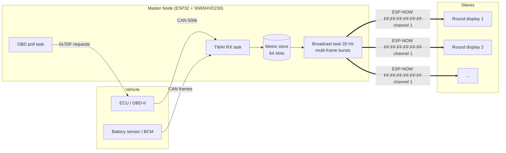

# Master Node Blueprint — Automotive CAN → ESP-NOW Telemetry Bridge

**Version 1.0 · Protocol v1 · Companion firmware to the ESP32-C3 Round Telemetry Display**

This document is the authoritative engineering blueprint for the **Master Node** ("Data
Firehose"): a vehicle-mounted ESP32 that reads the CAN bus, parses raw frames into
standardized engineering units, and broadcasts them continuously over ESP-NOW to any
number of display slaves. A complete, buildable reference implementation ships in
this folder ([`platformio.ini`](platformio.ini)) — this document explains every design
decision behind it.

---

## 1. Design Doctrine — Separation of Concerns

| | Master ("Data Firehose") | Slave ("Intelligent Canvas") |
|---|---|---|
| Knows the vehicle | **Yes** — CAN IDs, PIDs, scaling formulas | Never |
| Knows the UI | Never | **Yes** — layout.json, gauges, thresholds |
| Radio role | Broadcast-only transmitter | Receive-only listener |
| Adding a display | No change | Just power it on |
| Changing vehicles | Edit `CanDecoderConfig.h` only | No change |

The only coupling between the two firmwares is **`MasterPacket.h`** — a packed binary
contract. One copy lives in each project (`master/include/MasterPacket.h` and
`screens/*/include/MasterPacket.h`); **they must remain byte-identical**.



---

## 2. Hardware

### 2.1 Bill of Materials

| Part | Purpose | Notes |
|---|---|---|
| ESP32 DevKit (classic, dual-core) | Bridge MCU | Built-in TWAI (CAN 2.0) controller |
| SN65HVD230 **or** TJA1051/3 | CAN transceiver | 3.3 V logic — **do not** use 5 V-only TJA1050 without level care |
| Buck converter 12 V → 5 V (automotive-rated) | Power | Must survive load-dump transients; add a 500 mA fuse tap |
| OBD-II male connector / pigtail | Bus access | Or a branch splice on a body harness |
| Optional: LDR + 10 kΩ divider | Night detection | See `NIGHT_SOURCE` in config |

### 2.2 Wiring

| ESP32 pin | Signal | Goes to |
|---|---|---|
| GPIO 5 (`CAN_TX_GPIO`) | TWAI TX | Transceiver **CTX/TXD** |
| GPIO 4 (`CAN_RX_GPIO`) | TWAI RX | Transceiver **CRX/RXD** |
| 3V3 | Power | Transceiver VCC |
| GND | Ground | Transceiver GND **and** vehicle chassis ground |
| — | CANH | OBD-II **pin 6** |
| — | CANL | OBD-II **pin 14** |
| VIN (5 V) | Power | Buck output (input: OBD-II pin 16 = +12 V batt, pin 4/5 = GND) |
| GPIO 34 (`NIGHT_LDR_GPIO`) | ADC | LDR divider midpoint (optional) |

**Termination:** the vehicle bus is already terminated (2 × 120 Ω). The bridge is a
*stub* — leave the transceiver's 120 Ω termination **disabled/unsoldered**. Only enable
it on a bench bus you build yourself.

**RS pin (SN65HVD230):** tie to GND for high-speed mode.

### 2.3 Safety rules (non-negotiable)

1. **First contact with any vehicle is LISTEN-ONLY** (`OBD_POLLING_ENABLED 0`,
   `TWAI_MODE_LISTEN_ONLY`). The controller never ACKs, never transmits, and is
   electrically incapable of corrupting bus traffic.
2. Enable OBD polling (`NORMAL` mode) only on the diagnostic bus behind the OBD port,
   never on a spliced body/chassis bus you don't fully understand.
3. Bench note: a listen-only node on a 2-node bench bus means **nobody ACKs** — the
   transmitter will retry endlessly. For bench work either use NORMAL mode or add a
   third acking node.
4. The firmware self-heals from bus-off (`twai_initiate_recovery()` in the
   housekeeping task) so a transient short never bricks the bridge.

---

## 3. The Data Contract (`MasterPacket.h`)

### 3.1 Wire format

```
MasterTelemetryPacket (packed, little-endian):
┌──────────────┬──────────────┬──────────────┬─────────────────────────────┐
│ sequence_id  │ timestamp_ms │ metric_count │ metrics[metric_count]       │
│ uint32 (4 B) │ uint32 (4 B) │ uint8 (1 B)  │ metric_count × 7 B          │
└──────────────┴──────────────┴──────────────┴─────────────────────────────┘
MetricEntry (7 B):  uint16 metric_id · float value · uint8 flags
```

- Header = 9 B; a full frame of 28 metrics = **205 B ≤ 250 B** (ESP-NOW hard limit),
  enforced by `static_assert`.
- Only the *used* portion is transmitted: `TELEMETRY_PACKET_SIZE(metric_count)`.
- Slaves validate with `telemetry_packet_valid()` before touching a byte.

### 3.2 Scaling beyond 28 metrics — multi-frame bursts

ESP-NOW v1 frames cap at 250 bytes. ESP-NOW v2 (IDF 5.x) allows 1490 B **but silently
falls back to 250 B when any v1 peer participates** — a trap, not a feature. The
contract therefore scales by **bursting**:

- Every broadcast cycle, the master chunks all fresh metrics into as many frames as
  needed (`broadcastTask` in the reference code), each ≤ 28 entries.
- Each frame is fully self-describing with its own incrementing `sequence_id`.
- A metric appears in exactly one frame per burst; slaves merge frames by `metric_id`
  into their store, so **the total channel count is unbounded** (the reference
  implementations size their stores at 64 on both ends — raise both if you need more).
- Slave drop statistics still work: gaps in `sequence_id` count lost frames whether
  frames travel alone or in bursts.

### 3.3 Flags

| Bit | Name | Semantics |
|---|---|---|
| 0 | `VALID` | Value fresh & trustworthy; slaves render `--` when clear |
| 1 | `WARNING` | Master threshold table crossed — yellow tier |
| 2 | `CRITICAL` | Master threshold table crossed — red tier |
| 3 | `NIGHT` | Vehicle in night mode (set on **every** entry of a frame) |
| 4–7 | reserved | Transmit as 0 |

Master flags are a *safety floor*: the slave's own configurable thresholds can escalate
an alarm but never suppress a master-flagged one.

### 3.4 Metric ID registry

The 16-bit ID space (full list with mandatory units in `MasterPacket.h`):

| Range | Domain | Examples |
|---|---|---|
| `0x01xx` | OBD-II Service 01 (low byte = PID) | `0x010C` RPM, `0x0105` Coolant °C, `0x0142` Battery V |
| `0x02xx` | OBD Service 22 / manufacturer extended | project-defined |
| `0x10xx` | Raw-CAN powertrain/chassis | `0x1001` Boost bar, `0x1004` EGT °C |
| `0x11xx` | **Raw-CAN electrical system** | `0x1101` Battery A, `0x1102` SOC %, `0x1105` Alternator V, `0x1108` 12 V rail, `0x1109` Total load W |
| `0x1Fxx` | Housekeeping | `0x1F01` night sense, `0x1F02` master uptime |

Values are **always broadcast in the registry's mandated engineering unit** (°C, bar,
V, A, %, km/h…). All vehicle-specific scaling happens on the master; a slave layout is
therefore portable across cars.

### 3.5 Radio parameters

- Broadcast MAC `FF:FF:FF:FF:FF:FF`, no pairing, no encryption (broadcast frames
  cannot be encrypted in ESP-NOW).
- **`TELEMETRY_WIFI_CHANNEL` (default 1) must match on master and slave** — it is part
  of the contract. Broadcast delivery is fire-and-forget (no ACK for broadcast), which
  is exactly right for a firehose: late data is worthless, the next frame is 50 ms away.
- Versioning: breaking struct changes bump `TELEMETRY_PROTO_VERSION` and require
  flashing both nodes. New metric IDs are always non-breaking.

---

## 4. CAN Acquisition — Two Complementary Strategies

### 4.1 Strategy A: OBD-II active polling (`OBD_POLL_TABLE`)

For any 2008+ vehicle, Service 01 PIDs are the reliable baseline. The engine sends
single-frame requests to the functional address **0x7DF** and parses replies from
**0x7E8–0x7EF**:

```
Request : 0x7DF  [02 01 <PID> 55 55 55 55 55]     (ISO-TP single frame)
Response: 0x7E8  [len 41 <PID> A B ...]
```

Every supported PID reduces to `value = raw × scale + offset` with `raw = A` or
`A·256+B` — the table in `CanDecoderConfig.h` carries the pre-reduced constants:

| PID | Metric | Formula | Table entry (bytes, scale, offset) |
|---|---|---|---|
| 0x0C | RPM | (256A+B)/4 | 2, 0.25, 0 |
| 0x0D | Speed km/h | A | 1, 1, 0 |
| 0x05 | Coolant °C | A−40 | 1, 1, −40 |
| 0x04 | Load % | 100A/255 | 1, 0.3922, 0 |
| 0x42 | **Battery/module V** | (256A+B)/1000 | 2, 0.001, 0 |
| 0x5B | **Hybrid pack SOC %** | 100A/255 | 1, 0.3922, 0 |

Scheduling: each PID has its own period (RPM at 50 ms, fuel level at 5 s); the poll
task keeps **one request in flight at a time** with ≥ 60 ms spacing — polite to slow
ECUs and gateway modules.

### 4.2 Strategy B: passive raw-frame decoding (`RAW_SIGNAL_TABLE`)

For everything the OBD port doesn't expose — **especially the electrical system**
(intelligent battery sensor, alternator load, headlight status) — the master decodes
periodic broadcast frames DBC-style. Each entry describes one signal:

```
{ can_id, extended, start_bit, bit_length, byte_order, is_signed, scale, offset, metric_id }
```

Bit extraction (implemented in `extractRaw()` / `decodeSignal()`):

- **Intel / little-endian** (`@1+` in DBC): assemble the 8 payload bytes into a 64-bit
  word with byte 0 least-significant; `raw = (word >> start_bit) & mask`.
- **Motorola / big-endian** (`@0+`): assemble with byte 0 most-significant; convert
  the DBC MSB start bit to a word offset: `msb = 8·(start/8) + (7 − start mod 8)`,
  then `raw = (word >> (64 − msb − length)) & mask`.
- Signed signals get two's-complement sign extension before scaling.

**Worked example** — IBS battery current, `0x35A`, Intel, start 16, length 16, signed,
scale 0.1 A: payload `[A0 2E  38 FF  64 19 00 00]` → bytes 2..3 little-endian =
`0xFF38` → signed = −200 → **−20.0 A** (discharging).

> ⚠️ The electrical entries shipped in `RAW_SIGNAL_TABLE` are *representative
> examples* in typical IBS/BCM style. Actual IDs, positions and scales differ per
> manufacturer — capture your own bus (see §7) or use a public DBC before trusting
> any electrical reading.

### 4.3 Where each electrical metric usually comes from

| Metric | Best source |
|---|---|
| Battery voltage `0x0142` | OBD PID 0x42 (always available) or IBS frame (more accurate, at the post) |
| Battery current/SOC/SOH/temp `0x1101–0x1104` | IBS on the battery negative post, broadcast on body CAN (often gatewayed from LIN) |
| Alternator V/A/load `0x1105–0x1107` | ECU load-management frames (COM/LIN alternators are gatewayed to CAN on most platforms) |
| 12 V rail `0x1108` | BCM/fuse-box status frame, or measure locally with a divider and publish |
| Total load `0x1109` | Compute on master: `batt_V × (alt_A − batt_A)` when both sources exist |
| Night flag | BCM light-status bit (preferred) or LDR fallback |

---

## 5. Firmware Architecture (reference implementation)

Four FreeRTOS tasks, deliberately split across the two cores so CAN timing never
fights the Wi-Fi stack:

| Task | Core | Prio | Job |
|---|---|---|---|
| `twaiRxTask` | 1 | 10 | Blocking `twai_receive`; OBD responses + raw table decode → `publishMetric()` |
| `obdPollTask` | 1 | 5 | Per-PID scheduler, single outstanding request |
| `broadcastTask` | 0 | 8 | 20 Hz: snapshot fresh metrics → flags → multi-frame burst → `esp_now_send` |
| `housekeepingTask` | 0 | 3 | Night detection (LDR hysteresis or CAN bit), uptime metric, TWAI bus-off recovery |

Shared state is a 64-slot metric store guarded by a spinlock; the broadcaster copies
under lock and does all flag math and radio work outside it. TWAI RX queue depth is 64
frames to ride out full-bus bursts at 500 kbit/s.

**Freshness:** a metric not refreshed within `METRIC_TTL_MS` (1 s) silently leaves the
broadcast; the slave then marks it stale and renders `--`. Validity is thus end-to-end:
sensor → master TTL → `VALID` flag → slave stale timer.

---

## 6. Configuration Walkthrough (`CanDecoderConfig.h`)

Bring-up order for a new vehicle:

1. **Wire + listen:** `OBD_POLLING_ENABLED 0`, flash, open serial monitor. The 5 s
   stats line must show `CAN rx` climbing. If zero: swap CTX/CRX, check bitrate.
2. **Enable OBD:** set `OBD_POLLING_ENABLED 1` (on the OBD port only). Watch
   `OBD resp` climb and metrics appear on a slave's diagnostics screen.
3. **Map raw signals:** capture candump logs (§7), identify frames, fill
   `RAW_SIGNAL_TABLE` — start with the electrical system IBS frame.
4. **Set the safety floor:** adjust `THRESHOLD_TABLE` (per-metric warn/crit bounds,
   `NAN` disables a bound; low bounds catch undervoltage, high bounds overheat/overrev).
5. **Pick the night source:** `NIGHT_SOURCE_CAN` with a headlight bit, or
   `NIGHT_SOURCE_LDR` with the divider on GPIO 34.

---

## 7. Bench & Vehicle Test Plan

| # | Test | Method | Pass criterion |
|---|---|---|---|
| 1 | Contract sanity | Build both projects | `static_assert`s compile clean |
| 2 | Radio link | Master on bench, no CAN; slave diag screen | `Seq` climbing, `Drops 0`, ~20 pkt/s |
| 3 | Burst integrity | Add >28 fake `publishMetric` calls in a test task | Slave receives 2 frames/cycle, all metrics update, no drop growth |
| 4 | CAN decode | Second ESP32 as frame generator replaying candump logs | Metrics match the log values |
| 5 | OBD engine | ELM327-style bench simulator or the car, ignition on | `OBD resp` ≥ requests·0.95 |
| 6 | Alarm path | Force coolant > crit in simulator | Slave strobes overlay within 100 ms |
| 7 | Range/robustness | Master in engine bay, slave on dash, engine running | pps ≥ 18, drops < 1 % |
| 8 | Bus-off recovery | Short CANH-CANL for 2 s on the **bench** bus | Node logs recovery, resumes RX |

Capture tooling: any ESP32 running the RX task with frames printed, a USB-CAN adapter
with `candump -L`, or SavvyCAN for pattern-spotting (which bytes move with revs, with
lights, with load…).

---

## 8. Known Limits & Extension Points

- **Multi-frame ISO-TP responses** (VIN, DTCs, Service 22 on some ECUs) are not
  implemented — the poll engine is single-frame by design. Extend
  `handleObdResponse()` with flow-control (`0x30`) handling if you need Service 22.
- **29-bit OBD** (some trucks/US models): requests go to `0x18DB33F1`, responses from
  `0x18DAF1xx` — add an `extended` variant of `obdRequest()`.
- **Security:** ESP-NOW broadcasts are plaintext by protocol. The firehose carries no
  personal data, but if spoofing worries you, append a truncated HMAC to the frame
  tail and verify on the slave (bytes are available: 205 used of 250).
- **Second display / logger:** free — any listener on channel 1 sees the firehose.

---

## 9. Deliverable Map

| File | Role |
|---|---|
| [`platformio.ini`](platformio.ini) | Standalone PlatformIO project (ESP32 DevKit) |
| [`include/MasterPacket.h`](include/MasterPacket.h) | The contract — byte-identical twin of the slave's copy |
| [`include/CanDecoderConfig.h`](include/CanDecoderConfig.h) | **The only file you edit per vehicle** |
| [`src/main.cpp`](src/main.cpp) | Full reference implementation of everything above |
